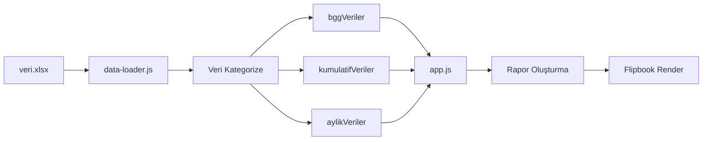
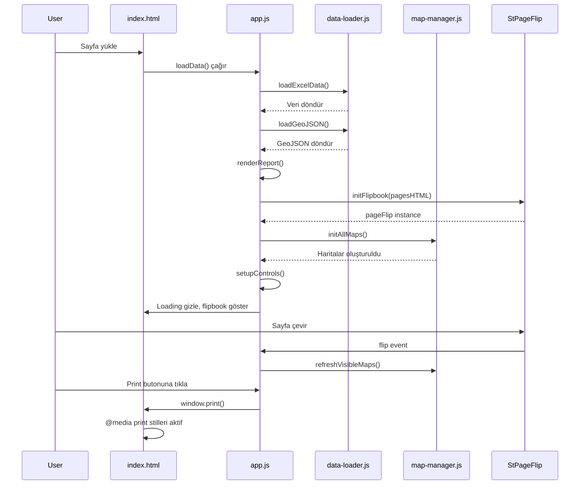

# Rapor Otomasyon Sistemi - Kod Analizi

## 📋 Genel Bakış

**Proje Adı:** Rapor Otomasyon Sistemi (İlçe Kartları)  
**Versiyon:** v13.1.x (Modular Micro-App Mimarisi)  
**Ana Özellik:** 3D Flipbook tabanlı profesyonel rapor görüntüleme sistemi

---

## 🏗️ Mimari Yapı

### Modüler Organizasyon

Proje, modern bir mikro-uygulama mimarisi kullanarak tamamen modüler bir yapıda organize edilmiştir:

```
rapor-sistemi/
├── index.html              # Ana HTML dosyası (minimal, modüler)
├── index_original.html     # Orijinal monolitik versiyon (yedek)
│
├── css/                    # Modüler CSS dosyaları
│   ├── main.css           # Temel stiller ve değişkenler
│   ├── cover.css          # Kapak sayfası stilleri
│   ├── pages.css          # Sayfa içerik stilleri
│   ├── components.css     # Bileşen stilleri
│   ├── flipbook.css       # Flipbook arayüz stilleri
│   └── print.css          # Yazdırma stilleri
│
├── js/                    # Modüler JavaScript dosyaları
│   ├── app.js             # Ana uygulama mantığı (697 satır)
│   ├── config.js          # Konfigürasyon sabitleri
│   ├── data-loader.js     # Excel veri yükleme
│   ├── map-manager.js     # Harita yönetimi
│   ├── utils.js           # Yardımcı fonksiyonlar
│   └── renderers/         # (Boş - gelecek modüller için)
│
├── data/
│   └── istanbul.geojson   # İstanbul ilçe sınırları (2.7 MB)
│
├── hizmet-verileri/
│   └── veri.xlsx          # Ana veri kaynağı
│
├── libs/                  # Harici kütüphaneler
│   ├── leaflet.css
│   ├── leaflet.js
│   └── xlsx.full.min.js
│
└── logo/                  # Logo dosyaları
```

---

## 🔧 Teknoloji Yığını

### Frontend Kütüphaneleri

| Kütüphane | Versiyon | Kullanım Alanı |
|-----------|----------|----------------|
| **StPageFlip** | 2.0.7 | 3D flipbook animasyonları |
| **Leaflet.js** | - | İnteraktif harita görselleştirme |
| **SheetJS (xlsx)** | - | Excel dosya okuma |
| **jsPDF** | 2.5.1 | PDF oluşturma |
| **html2canvas** | 1.4.1 | HTML'den canvas dönüşümü |

### Stil ve Tipografi

- **CSS Framework:** Vanilla CSS (modüler)
- **Font:** Montserrat (Google Fonts)
- **Renk Paleti:** Blue-centric professional theme
- **Responsive Design:** A4 sayfa formatına optimize (210mm × 297mm)

---

## 📊 Veri Akışı

### Veri Kaynağı: `veri.xlsx`

Excel dosyası 3 ana sayfa içerir:

#### 1. **Hizmetler Sayfası**
```javascript
{
  mudurluk: "Müdürlük adı",
  hizmet: "Hizmet Başlığı",
  tur: "Tür",
  lokasyon: "İlçe adı / İstanbul Geneli",
  veriAraligi: "BGG | KÜMÜLATİF | AYLIK",
  deger: Number,
  sonTarih: Date
}
```

**Veri Kategorileri:**
- `BGG`: Belediye Geneli Gösterir
- `KÜMÜLATİF`: Yıllık toplam veriler
- `AYLIK`: Aylık veriler

#### 2. **Açıklamalar Sayfası**
```javascript
{
  "Hizmet Başlığı": "string",
  "Açıklama": "string"
}
```

#### 3. **Merkezler Sayfası**
```javascript
{
  mudurluk: "Müdürlük",
  ilce: "İlçe",
  tur: "Birim Türü",
  ad: "Birim Adı",
  lat: Number,
  lon: Number
}
```

### Veri İşleme Akışı



---

## 🎯 Ana Modüller Analizi

### 1. `index.html` (111 satır)

**Amaç:** Minimal HTML yapısı ve kütüphane yüklemeleri

**Yapı:**
```html
<!-- Kütüphane Yüklemeleri -->
<head>
  - Leaflet CSS/JS
  - StPageFlip
  - jsPDF & html2canvas
  - SheetJS
  - Modüler CSS dosyaları (6 adet)
</head>

<body>
  <!-- Yükleme Ekranı -->
  <div id="flipbook-loading">...</div>
  
  <!-- Flipbook Ana Container -->
  <div id="flipbook-wrapper">
    <div id="flipbook-container">
      <div id="flipbook"></div>
    </div>
    
    <!-- Navigasyon Toolbar -->
    <div id="flipbook-toolbar">
      - Prev/Next butonları
      - Sayfa göstergesi
      - Zoom in/out
      - Fullscreen
      - Print/PDF
    </div>
  </div>
  
  <!-- Print için gizli rapor -->
  <div id="print-report"></div>
</body>
```

---

### 2. `app.js` (697 satır) - Ana Uygulama

**Fonksiyon Katmanları:**

#### A. Veri Depoları (Global)
```javascript
let bggVeriler = [];
let kumulatifVeriler = [];
let aylikVeriler = [];
let merkezler = [];
let aciklamalar = {};
let istanbulGeoJSON = null;
let pageFlip = null;
```

#### B. Yardımcı Fonksiyonlar
- `getColor(v, min, max)` - Harita renk hesaplama
- `groupBy(arr, key)` - Veri gruplama

#### C. Harita Fonksiyonları
- `initDetailMap(id, hizmet, tur, mudurluk)` - İlçe bazlı veri haritası
- `initMerkezMap(id, mudurluk)` - Merkezlerin konumsal haritası

**Harita Konfigürasyonu:**
```javascript
MAP_CONFIG = {
  center: [41.20, 29.0],  // İstanbul merkez
  zoom: 9.2,
  borderWeight: 0.8,
  borderColor: '#fff',
  fillOpacity: 0.85
}
```

#### D. Render Fonksiyonları
- `renderSectionPage(title, desc)` - Bölüm ara sayfaları
- `renderOzetSayfasi(data, sutunBasligi)` - Özet tablo sayfaları
- `renderReport()` - **ANA RAPOR OLUŞTURUCU** (188 satır)

**`renderReport()` İş Akışı:**
1. Kapak sayfası oluşturma
2. Müdürlüklere göre gruplama
3. Her müdürlük için:
   - BGG özet sayfası
   - Kümülatif veri sayfaları
   - Aylık veri sayfaları
   - Merkez lokasyon sayfası
4. HTML döndürme

#### E. Flipbook Yönetimi
- `initFlipbook(pagesHTML)` - StPageFlip başlatma
- `updatePageIndicator()` - Sayfa numarasını güncelleme
- `initAllMaps()` - Tüm haritaları başlatma
- `refreshVisibleMaps()` - Görünür haritaları yenileme

**StPageFlip Konfigürasyonu:**
```javascript
new St.PageFlip(container, {
  width: A4_WIDTH,
  height: A4_HEIGHT,
  size: 'stretch',        // Viewport optimizasyonu
  minWidth: 500,
  maxWidth: 2000,
  minHeight: 707,
  maxHeight: 2828,
  drawShadow: true,
  flippingTime: 800,
  usePortrait: false,
  startZIndex: 0,
  autoSize: true,
  maxShadowOpacity: 0.5,
  showCover: true,
  mobileScrollSupport: false
})
```

#### F. Kontroller
- `setupControls()` - Toolbar buton event listener'ları
  - Sayfa navigasyonu (prev/next)
  - Zoom (in/out)
  - Fullscreen
  - Print/PDF

#### G. Veri Yükleme
- `loadData()` - **ANA BAŞLATMA FONKSİYONU**
  1. Excel veri yükleme
  2. GeoJSON yükleme
  3. Rapor render
  4. Flipbook başlatma
  5. Harita başlatma
  6. Kontroller kurma
  7. Loading ekranını gizleme

---

### 3. `config.js` (30 satır)

**Amaç:** Merkezi konfigürasyon yönetimi

```javascript
// Renk Paleti (8 renk)
const palette = [
  '#3182ce', '#38a169', '#d69e2e', '#e53e3e',
  '#805ad5', '#00b5d8', '#ed8936', '#dd6b20'
];

// Ay İsimleri (Türkçe)
const months = ['Ocak', 'Şubat', ...];

// Sayfalama
const MAX_ROWS_PER_PAGE = 22;

// Harita Ayarları
const MAP_CONFIG = { ... };

// Renk Şemaları
const COLORS = {
  noData: '#f0f4f8',
  high: '#1a5490',
  medium: '#4299e1',
  low: '#a0c4e8'
};
```

---

### 4. `data-loader.js` (92 satır)

**Amaç:** Excel ve GeoJSON veri yükleme

**Ana Fonksiyonlar:**

#### `loadExcelData()`
```javascript
async function loadExcelData() {
  // 1. Excel dosyasını fetch
  const res = await fetch('hizmet-verileri/veri.xlsx');
  const buf = await res.arrayBuffer();
  
  // 2. SheetJS ile parse
  const wb = XLSX.read(buf, { 
    type: 'array', 
    cellDates: true 
  });
  
  // 3. Sayfaları işle
  // - Hizmetler -> BGG/Kümülatif/Aylık ayrımı
  // - Açıklamalar -> anahtar-değer mapping
  // - Merkezler -> koordinat parse
  
  return { ... };
}
```

#### `loadGeoJSON()`
```javascript
async function loadGeoJSON() {
  const geoRes = await fetch('data/istanbul.geojson');
  istanbulGeoJSON = await geoRes.json();
  return istanbulGeoJSON;
}
```

---

### 5. `map-manager.js` (77 satır)

**Amaç:** Leaflet harita yönetimi ve modülerleştirme

**Harita Instance Yönetimi:**
```javascript
const mapInstances = {}; // Tüm harita referansları
```

#### `initDetailMap(id, hizmet, tur, mudurluk, bggVeriler, istanbulGeoJSON)`

**İş Akışı:**
1. Harita elementi kontrolü ve duplicate önleme
2. Leaflet map oluşturma (zoom/attribution kapalı)
3. Veriyi filtreleme (müdürlük + hizmet + tür)
4. İlçe bazında toplama
5. Min/max değer hesaplama
6. GeoJSON layer ekleme
   - `style`: İlçeye göre renklendirme
   - `onEachFeature`: Tooltip ekleme
7. `invalidateSize()` ile render güncelleme

#### `initMerkezMap(id, mudurluk, merkezler, istanbulGeoJSON)`

**İş Akışı:**
1. Base harita oluşturma (neutral gri)
2. Merkezleri filtreleme
3. Tür bazında renk atama (palete göre)
4. `circleMarker` ile merkezleri işaretleme
5. Tooltip ekleme (ad, tür, ilçe)

---

### 6. `utils.js` (48 satır)

**Amaç:** Yeniden kullanılabilir yardımcı fonksiyonlar

```javascript
// Sayı formatlama (Türkçe locale)
fmt(n) → "1.234.567"

// Para birimi formatlama
fmtCur(n) → "1.234₺"

// Excel tarih → yıl dönüşümü
toYear(d) → 2024

// GeoJSON'dan ilçe adı çıkarma
distName(properties) → "Kadıköy"

// Array gruplama
groupBy(arr, 'mudurluk') → { "Müd1": [...], ... }

// Harita renk hesaplama (3-tier)
getColor(v, min, max) → "#1a5490" | "#4299e1" | "#a0c4e8"
```

---

## 🎨 CSS Modülleri

### `main.css` (124 satır)
- CSS değişkenleri (`:root`)
- Global reset
- Yükleme ekranı
- A4 sayfa boyutlandırma (210mm × 297mm)
- Sayfa footer (alt çizgi + sayfa numarası)

### `flipbook.css` (239 satır)
- Flipbook wrapper (fullscreen container)
- StPageFlip container
- Toolbar stilleri (dark theme, glassmorphism)
- Zoom transformasyonları
- Print media query (@media print)
- Loading spinner animasyonları

**Öne Çıkan Özellikler:**
```css
#flipbook-wrapper {
  background: #f8fafc; /* Off-white tema */
  /* Gradyan subtle arka plan */
}

#flipbook-toolbar {
  background: rgba(26, 32, 44, 0.95);
  backdrop-filter: blur(10px);
  border-radius: 50px; /* Pill shape */
}
```

### `cover.css`, `pages.css`, `components.css`
- Kapak sayfası düzeni
- Tablo stilleri
- Harita container stilleri
- Bölüm başlıkları

### `print.css` (347 satır)
- Print-to-PDF optimizasyonları
- Renk koruması (`print-color-adjust: exact`)
- Sayfa boyutlandırma
- Gizli `#print-report` container görünür yapma

---

## 🔄 Uygulama Yaşam Döngüsü



---

## 🗺️ Harita Sistemi Özellikleri

### Renk Kodlama Stratejisi

**3-Tier Gradient System:**
```javascript
ratio = (value - min) / (max - min)

if (ratio > 0.66)   → Koyu mavi (#1a5490)  // Yüksek
if (ratio > 0.33)   → Orta mavi (#4299e1)   // Orta
else                → Açık mavi (#a0c4e8)   // Düşük
Veri yok            → Açık gri (#f0f4f8)    // No data
```

### Harita Performans Optimizasyonları

1. **Lazy Initialization:**
   - Haritalar sadece ilk görüntülendiklerinde başlatılır
   - `initAllMaps()` tüm harita container'larını bulur ama render etmez

2. **Visibility-Based Refresh:**
   - Sadece görünür sayfalardaki haritalar `invalidateSize()` çağrısı alır
   - `refreshVisibleMaps()` sayfa çevirme eventlerinde tetiklenir

3. **Duplicate Prevention:**
   - `el._leaflet_id` kontrolü ile aynı haritanın tekrar oluşturulması engellenir

---

## 📄 PDF/Print Sistemi

### İki Aşamalı Strateji

#### 1. **Native Browser Print (Tercih Edilen)**
```javascript
function downloadPDF() {
  // Flipbook içeriğini #print-report'a kopyala
  document.getElementById('print-report').innerHTML = 
    document.getElementById('flipbook').innerHTML;
  
  // Tarayıcı print dialog'unu aç
  window.print();
}
```

**Avantajlar:**
- ✅ Zero-latency (anında)
- ✅ %100 harita fidelity
- ✅ Kullanıcı PDF seçeneğini seçebilir

#### 2. **Print Media Query**
```css
@media print {
  #flipbook-wrapper { display: none; }
  #print-report { 
    display: block !important; 
    visibility: visible !important; 
  }
  .page {
    width: 210mm !important;
    height: 297mm !important;
    page-break-after: always;
  }
}
```

---

## 🎯 Öne Çıkan Özellikler

### 1. **3D Flipbook Deneyimi**
- Gerçekçi sayfa çevirme animasyonları (800ms)
- Gölge efektleri
- Touch/mouse desteği
- Sayfa curl efekti

### 2. **Responsive Viewport Stabilization**
- `size: 'stretch'` - Sayfa viewport'a otomatik fit
- `ResizeObserver` ile içerik güncelleme
- Min/max genişlik/yükseklik sınırları

### 3. **Executive-Calibrated Theme**
- Off-white arka plan (#f8fafc) - göz yormaz
- Dark toolbar (glassmorphism)
- Professional blue palette

### 4. **Performance-First Approach**
- Lazy map initialization
- Visibility-based rendering
- Efficient GeoJSON caching

### 5. **Modüler Mimari**
- Tek sorumluluk prensibi
- Kolay bakım
- Gelecek genişlemeler için hazır yapı
- Export/import sistemi

---

## 📈 Veri Görselleştirme Katmanları

### Sayfa Tipleri

1. **Kapak (Cover Page)**
   - Logo
   - Başlık
   - Tarih

2. **Bölüm Sayfaları (Section Pages)**
   - Müdürlük başlıkları
   - Açıklama metni

3. **Özet Tablosu (Summary Tables)**
   - Hizmet listesi
   - Tür ve değer kolonları
   - Max 22 satır/sayfa
   - Sayfalama sistemi

4. **Detay Sayfaları**
   - Harita görselleştirme
   - İlçe bazlı veri dağılımı
   - Tooltip ile detay

5. **Merkez Lokasyonları**
   - Tüm müdürlük merkezleri
   - Tür bazlı renk kodlama
   - CircleMarker ile işaretleme

---

## 🚀 Başlatma ve Kullanım

### Development Server
```bash
npx -y http-server . -p 3000 -c-1 -o
```

### Kullanıcı Etkileşimleri

| Aksiyon | Fonksiyon | Efekt |
|---------|-----------|-------|
| Sayfa çevirme | `pageFlip.flip()` | Animasyonlu geçiş |
| Prev/Next | `flipToPrevious()` / `flipToNext()` | Navigasyon |
| Zoom In | Container scale(1.3) | %30 büyütme |
| Zoom Out | Container scale(0.7) | %30 küçültme |
| Fullscreen | `requestFullscreen()` | Tam ekran |
| Print/PDF | `window.print()` | Native print dialog |

---

## 🔍 Kod Kalitesi ve İyileştirmeler

### Güçlü Yönler
✅ **Modüler yapı** - Her dosya tek sorumluluk  
✅ **Modern ES6+** - Arrow functions, async/await, template literals  
✅ **Performans odaklı** - Lazy loading, visibility checks  
✅ **Kullanıcı deneyimi** - Smooth animations, professional design  
✅ **Dokümantasyon** - İyi yorumlanmış kod  

### İyileştirme Önerileri

⚠️ **Hata Yönetimi:**
```javascript
// Şu anki:
const res = await fetch('hizmet-verileri/veri.xlsx');

// Önerilen:
try {
  const res = await fetch('hizmet-verileri/veri.xlsx');
  if (!res.ok) throw new Error('Veri yüklenemedi');
} catch (error) {
  // Kullanıcıya friendly mesaj göster
  showErrorMessage('Veri yüklenirken hata oluştu');
}
```

⚠️ **Module System:**
- `config.js`, `data-loader.js`, `map-manager.js` gibi dosyalar `export` kullanıyor
- Ancak `index.html`'de `<script type="module">` tanımı yok
- Bu durumda modüller çalışmayabilir

**Çözüm:**
```html
<!-- index.html -->
<script type="module" src="js/app.js"></script>
```

⚠️ **Loading States:**
- Harita yüklenirken placeholder gösterilebilir
- Veri yoksa kullanıcıya bilgi verilebilir

---

## 📦 Bağımlılıklar ve Versiyonlar

### CDN Kaynakları
```html
<!-- StPageFlip -->
https://cdn.jsdelivr.net/npm/page-flip@2.0.7/dist/js/page-flip.browser.js

<!-- PDF Tools -->
https://cdnjs.cloudflare.com/ajax/libs/jspdf/2.5.1/jspdf.umd.min.js
https://cdnjs.cloudflare.com/ajax/libs/html2canvas/1.4.1/html2canvas.min.js

<!-- Fonts -->
https://fonts.googleapis.com/css2?family=Montserrat:wght@300;400;500;600;700;800;900
```

### Local Libraries
- `libs/xlsx.full.min.js` - Excel okuma
- `libs/leaflet.js` + `leaflet.css` - Harita

---

## 🎓 Öğrenilen Teknikler ve Desenler

### 1. **Flipbook Implementation**
StPageFlip kütüphanesi ile gerçekçi 3D sayfa çevirme implementasyonu.

### 2. **Dynamic Content Generation**
JavaScript ile dinamik HTML oluşturma ve DOM manipülasyonu.

### 3. **Choropleth Maps**
Leaflet + GeoJSON ile coğrafi veri görselleştirme.

### 4. **Modular Architecture**
ES6 modules ile kod organizasyonu ve yeniden kullanılabilirlik.

### 5. **Print Optimization**
CSS media queries ile print-specific styling.

### 6. **Excel Data Processing**
SheetJS ile frontend Excel okuma ve işleme.

---

## 📝 Sonuç

**Rapor Otomasyon Sistemi**, modern web teknolojilerini kullanarak profesyonel, okunabilir ve etkileşimli raporlar oluşturan **production-ready** bir uygulamadır. 

### Temel Güçlü Yanları:
- 🎯 **Modüler ve sürdürülebilir mimari**
- 🚀 **Performans optimizasyonları**
- 🎨 **Professional UI/UX design**
- 📊 **Rich data visualization**
- 📄 **Native browser print support**
- 🗺️ **Interactive geospatial maps**

### Kullanım Senaryoları:
- İlçe bazlı hizmet raporları
- Müdürlük performans sunumları
- Veri analiz ve görselleştirme
- Executive presentations
- PDF export için hazır raporlar

Kod tabanı **v13.1.x** versiyonunda olup, flipbook özelliği ile **industrial-grade** bir seviyeye ulaşmıştır.
